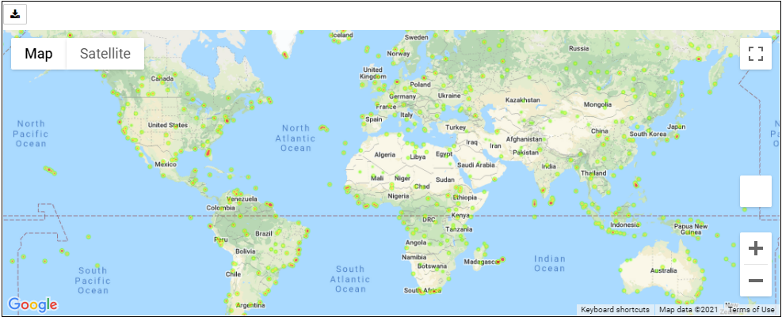
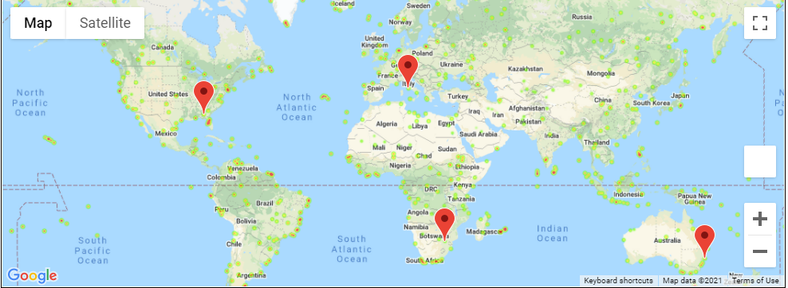

# python-api: What's the Weather Like?

## Background

This homework consists of two parts: Part 1: `WeatherPy` (OpenWeatherMap API) and Part 2: `VacationPy` (Google Places API).

In part 1, we are supposed to visualize the weather of 500+ cities across the world of varying distance from the equator by utilizing the CitiPy library and the OpenWeatherMap API. Reuslting cities from this part will be used in part 2, where we use the weather data retrieved to plan an ideal vacation.

* The script was coded using Jupyter notebook. The libraries used were Pandas, Matplotlib, CitiPy, NumPy, SciPy, time, requests. APIs used were OpenWeatherMap and Google Places.

* All files are inside the folder named for each part `WeatherPy` and `VacationPy` respectively. Each folder contains:

    * A Jupyter notebook named after the challenge to run the analysis. The notebook also contains observations and insights that were made looking at the data (this is also below under *Analysis*).

    * A `config.py` file that contains the API key needed to make the API call. This is where you enter your keys in order for the notebook to run properly.

    * An `output_data` folder that contains the CSV file `cities.csv` created in part 1

    * An `Images` folder that contains:
      - PNG files of 4 scatter plots created in part 1, as well as 8 linear regression plots.
      - A heatmap created in part 2, along with a second map including hotel markers
    

## WeatherPy

### Analysis

* There does not appear to be much correlation seen in the temperature vs. latitude relationship across all cities combined. However, this changes once we separate the data into hemispheres and observe the below.

* There is a strong correlation in the relationship between latitude and max temperature (F) in the northern and southern hemispheres. The northern hemisphere shows a strong negative correlation with temperatures decreasing as you move away from the equator (increasing latitude), while the southern hemisphere shows a strong positive correlation with temperatures increasing as you move towards the equator (increasing latitude).

* There is a trend of higher humidity levels in a majority of cities in the northern hemisphere at this time regardless of distance from the equator, as compared to cities in the southern hemisphere.

## VacationPy

The weather data retrieved in part 1 was used in creating a humidity heatmap of all the cities. 

  

The next step was identifying cities to vacation in based on ideal weather conditions. Any cities that did not meet ALL of the below conditions were not taken into consideration:

* Cities with a max temperature lower than 80 degrees but higher than 70.

* Cities with wind speed less than 10 mph.

* Cities with zero cloudiness.

* Cities with humidity less than 75%

  
